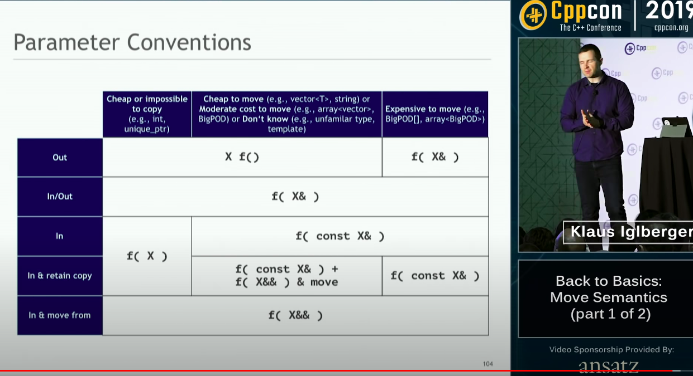

# Notes from CppCon 2019: Klaus Iglberger “Back to Basics: Move Semantics"

It is recommended to go through [Ben Saks "Understanding Value Categories" before going through this](./2019_Ben_Saks_BTB_Understanding_Value_Categories.md)

## lvalue vs rvalue

An easy way to remember lvalue vs rvalue is that lvalue have a name that the programmer have chosen. While rvalue don't have a programmer imposed name, or no name at all.

```cpp
// just an weird example
std::string a, b;
a + b = c; // valid c++ code, strings are special, they live on the data space, even if they are rvalue
```

```cpp
template<typename T, typename A = ... >
class vector {
    public:
    // copy assignment operator
    vector& operator = (const vector& rhs);
    // move assignment operator
    vector& operator = (vector&& rhs);
}

std::vector<int> createVector() {
    return std::vector<int>{...};
}

int main() {
    std::vector<int> v1{1,2,3,4,5};
    std::vector<int> v2{};

    v2 = v1; // will call copy assignment operator
    v2 = createVector(); // would have called copy assignment operator prior to c++11, as we had no move assignment operator then, now it will call move assignment operator, as it is called with an Rvalue
    v2 = std::move(v1); // would call move assignment operator, will steal data from v1 to v2. std::move change the lvalue to an xvalue

    // v1 is still alive, it lives a litte longer
    // The moved from object is in a valid but undefined state
    return 0;
}
```

## std::move

unconditionally casts its input into an rvalue(xvalue) reference

```cpp
//Example implementation of std::move

template<typename T>
std::remove_reference_t<T>&& move(T&& t) noexcept {
    return static_cast<std::remove_reference_t<T>&&>(t);
}
```

Containers in C++ employ value semantics. In pre-c++11 this leads to unnecessary copy operations. C++11 introduces rvalue references to distinguish between lvalues and rvalues. Rvalue references represent modifiable objects that are no longer needed.

## New special member functions

```cpp
class Widget {
    private:
    int i{0};
    std::String s{};
    unique_ptr<int> pi{};

    public:
    // Move constructor
    Widget(Widget&& w) = default;
    // Move assignment operator
    Widget& operator=(widget&& w) = default;
}
```

For above class things are easy. Core Guideline C.20: If you can avoid defining default operations, do (Rule of zero)

```cpp
class Widget {
    private:
    int i{0};
    std::String s{};
    int* pi{mullptr}

    public:
    // Move constructor
    Widget(Widget&& w) noexcept:
    i(std::move(w.i)),
    // s(w.s), // not a move so we need to use std::move
    s(std::move(w.s)),// use std::move with everything for uniformity
    pi(std::move(w.pi)) // it will not w.pi as in unique_ptr case
    {
        w.pi = nullptr; // without this two pointers will destroy the object, and that will be bad
    }
    // Move assignment operator
    Widget& operator=(widget&& w) { 
        delete pi; // if we don't do this we will leak resources
        
        i = std::move(w.i);
        s = std::move(w.s);
        pi = std::move(w.pi);

        w.pi = nullptr;
        return *this;
    }
}
```

**Make move operations noexcept**. Why ?

First of all, it is not wrong, it will not throw an error. As move is not allocating extra memory.

push_back provides strong safety guarantee, if an error happen, the state of the container will stay as if no operation happened. So, push_back is very conservative if the std::move is not

C.64 : Ideally, that moved-from should be the default value of the type. default implementation doesn't do it though. So, probably we also need not to default initialize these variables.

Move construction can be thought to have two phases

1. Member-wise move (If phase 1 is only thing that you need, use default, default is also noexcept)
2. Reset

With a raw pointer the compiler can't be sure if it is an owning pointer or non-owning pointer that is why we have to explicitly reset it. That is not the case with unique_ptr, that why the default constructor can reset it for you. unique_ptr move construction implementation resets the passed unique_ptr.

### Now Move assignment operator

1. Clean up all visible resources (or else, resource will leak)
2. Transfer the content of w into this
3. Leave w in a valid but undefined state

**Moving to self should be not allowed. This operation don't make any sense. As after move operation the moved from object is supposed to be not required anymore. A move from self is not undefined behavior, but the value of the object is in an undefined state.**

## The new special member functions

We should not remember these rules(just use rule or 0 or rule of 5). **C.21: If you define or delete any default operation, define or delete them all.**

1. The default move operations are generated if no copy operation or destructor is defined.
2. The default copy operations are generated if no move operation is user-defined.
3. Note: = default and =delete count as user-defined!

**What is this parameter convention matrix showing in the end. Deep dive in it further, when you get a chance.**



## Forwarding References

```cpp
template<typename T>
void f(T&& x); // Forwarding reference

// or

auto&& var2 = var1; // Forwarding reference
```

- Forwarding reference represent lvalue reference if they are initialized by an lvalue, or, an rvalue reference if they are initialize with an rvalue reference.

```cpp
template<typename T>
void foo(T&& ) {
    puts("foo(T&&)");
}

// Called with an lvalue
//above will be deduced as
// template<>
// void foo(Widget& &&) {
//     puts("foo(T&&)");
// }

// Called with an rvalue
//above will be deduced as
// template<>
// void foo(Widget &&) {
//     puts("foo(T&&)");
// }

int main();
{
    Widget w{};
    foo(w); // Prints 'foo(T&&)'
    foo(Widget{}); // Prints 'foo(T&&)'
}
```

This function that looks like as if we it takes an rvalue is called by an lvalue reference. And then we have reference collapsing.

## The problem of perfect forwarding

If you want to pass arguments to the function that is only supposed to forward the argument to the constructor T ?

```cpp
namespace std{
    template<typename T, ???>
    unique_ptr<T> make_unique(???)
    {
        return unique_ptr<T>(new T(???));
    }

    // pre c++11
    // will not work for types that are not copyable, 
    // but copy is costly even if we want to do it.
    template<typename T, typename Arg>
    unique_ptr<T> make_unique(Arg arg)
    {
        return unique_ptr<T>(new T(arg));
    }

    template<typename T, typename Arg>
    unique_ptr<T> make_unique(Arg& arg)
    {
        return unique_ptr<T>(new T(arg));
    }
    // if we pass the arguments by reference the following will not compile
    std::make_unique<int>(1); // Compilation error, rvalue


    // Following works for a lot of cases but
    template<typename T, typename Arg>
    unique_ptr<T> make_unique(const Arg& arg)
    {
        return unique_ptr<T>(new T(arg));
    }

    struct Example { Example(int&); };
    int i{1};
    std::make_unique<Example>(i); // Always adds const, thus will not compile
}
```

No perfect solution existed before forwarding reference. This allows you to pass anything. This accepts anything and everything, const non-const, lvalue, rvalue.....

```cpp
namespace std {
    template<typename T, typename Arg>
    unique_ptr<T> make_unique(Arg&& arg)
    {
        return unique_ptr<T>(new T(arg));
    }
}
```

Even above solutino is not perfect, as inside the function, arg is lvalue, so it will not move the passed argument. But, if we attempt to use std::move then we will even move lvalues that are passed to it. So, we are looking for a conditional move, that will only cast it to rvalue if the value is of type rvalue reference.

```cpp
template<typename T>
T&& forward(std::remove_reference<T>& t) noexcept
{
    return static_Cast<T&&>(t);
}
```

std::forward is a conditional cast, it cast an lvalue to lvaue, and rvalue to rvalue. In comparison move is an unconditional cast to rvalue reference.

```cpp
template<typename T>
std::remove_reference<T>&& move(T&& t) noexcept
{
    return static_Cast<std::remove_reference<T>&&>(t);
}
```

Now, lets look at our make_unique

```cpp
namespace std {
    template<typename T, typename... Args>
    unique_ptr<T> make_unique(Args&&... args)
    {
        return unique_ptr<T>(new T(std::forward<Args>(args)...));
    }
}
```

## Perils of Forwarding references

```cpp
struct Person {
    Person( const std::string& name); // (1)
    template<typename T> Person(T&&); // (2)
}
int main()
{
    Person p1("Bjarne"); // calls ctor (2);, argument type is char[7]
    std::string name("Herb");
    // calls ctor (2), argument type is not const
    Person p2(name); 
    // it should have called copy ctor, but it calls, ctor (2), 
    // as copy ctor take const, and P1 is not const.
    Person p3(p1); 
}
```

**The problem is with overloading forwarding references.**

```cpp
void f(Widget&);                // 1 (lvalue reference)
void f(const Widget&);          // 2 (lvalue reference to const)
void f(Widget&&);               // 3 (rvalue reference)
void f(const Widget&&);         // 4 (rvalue reference to const)
template<typename T>
void f(T&&);                    // 5 (forwarding reference)
template<typename T>
void f(const T&&);              // 6 (rvalue, reference to const, not a forwarding reference)

boid g() {
    Widget w1{};
    //1 is picked, function 5 is also instantiated, if template is instantiated with same signature as a non-template then non-template function is picked.

    f(w1); 
    // Priority sequence 1 -> [5] -> 2, other 3 are not option, as lvalue reference don't bind to rvalue

    const Widget w2{};
    f(w2); // 2 is picked, followed by 5
    // 2 -> [5] 

    f(getWidget());
    // 3 -> [5] -> 4 -> 6 -> 2(option 2 fallback from even before c++11)

    f(getConstWidget()):
    // 4 -> 6 -> [5] -> 2(fallback) 
}
```

## Move semantics pitfalls

1. If we are using forwarding reference then use std::forward with it, std::move should not be used with forwarding reference.

    ```cpp
    class A {
        public:
        template<typename T>
        A(T&& t) :
        b_(std::move<T>(t)){

        }
        private:
        B b_
    }
    ```

2. This is not a forwarding reference, so don't use std::forward. Its only a forwarding reference if it is using type deduciton. Here as soon as the class is instantiated. No more type deductions are happening.

    ```cpp
    class A {
        public:
        A(T&& t) :
        b_(std::forward<T>(t)){

        }
        private:
        B b_;
    }
    ```

3. Double move is not a defined behavior.

    ```cpp
    class A {
        public:
        A(T&& t) :
        b_(std::forward<T>(t)),
        c_(std::forward<T>(t)){
        }
        private:
        B b_;
        B c_;
    }
    ```

4. Don't return by std::move as it will make your code pessimistic, and will probably stop Return value optimization from taking place. F.45 don't return a T&&

    ```cpp
    template<typename... Args>
    std::unique_ptr<Widget> create(Args&&... args)
    {
        auto uptr(std::make_unique<Widget>(std::forward<Args>(args)...));
        return std::move(uptr); // Prevents RVO/ NRVO in this case as the object is named,
        // Remember RVO is a no-op, while std::move still costs us something
    }

    template<typename... Args>
    std::unique_ptr<Widget> create(Args&&... args)
    {
        return std::make_unique<Widget>(std::forward<Args>(args)...);
        // In c++17, above code is guaranteed to perform RVO
        // Well, if the compiler can't perform RVO, it falls back to move, so we get move for free.
    }
    ```

5. Type deduction is not always a concrete type.

    ```cpp
    template<typename T>
    void foo(T&&)
    {
        using NoRef = std::remove_reference_t<T>;
        if(constexpr(std::is_integral_v<NoRef>))
        {
            // Deal with integral types
        } else {
            // Deal with non-integral types
        }
    }
    ```

[HOME](../README.md)
